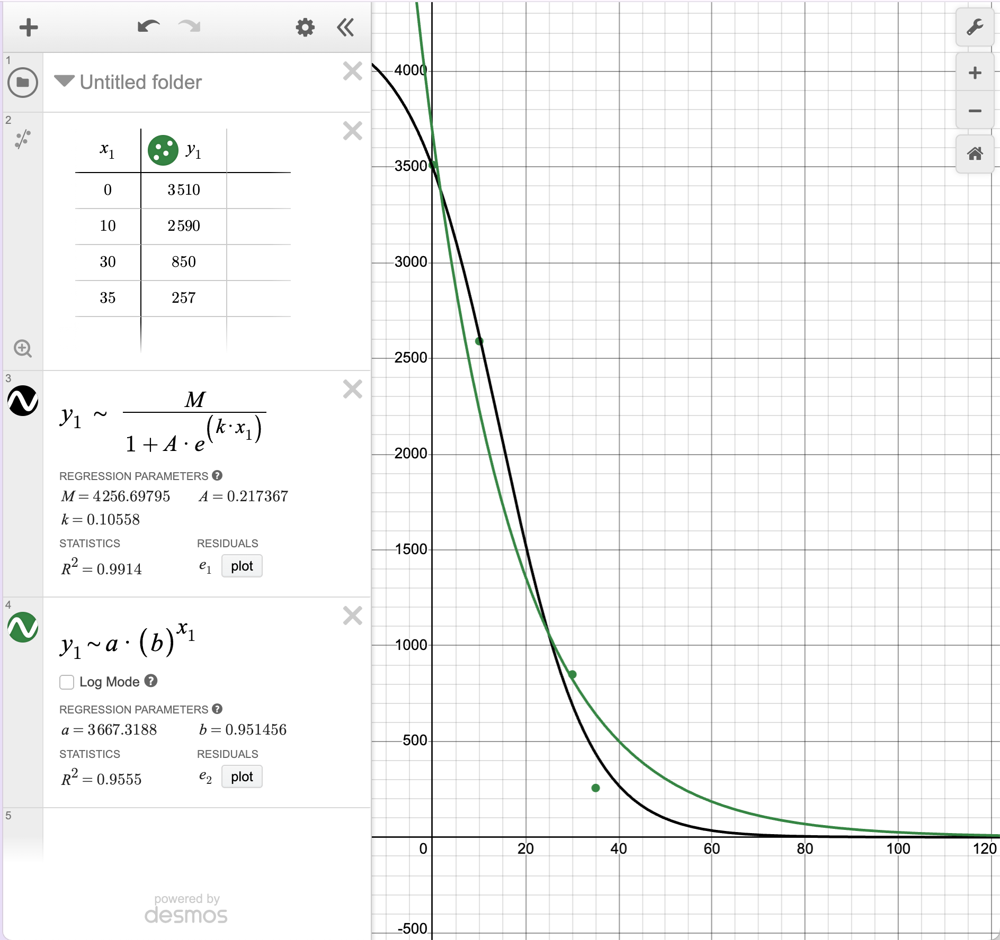

# Calculus Project 2: Fishstocks

### Q1: Fishstocks Research Part 1

* **The species you chose:** Thompson River Steelhead Trout in British Columbia. 
* **Data that shows the decline:** The population has crashed over the last few decades and they are currently classified as Endangered. 

**Population Data (Returning Adults)**
I set $t = 0$ as the year 1985.
* 1985 ($t=0$): 3,510
* 1995 ($t=10$): 2,590
* 2015 ($t=30$): 850
* 2020 ($t=35$): 257
* 2022 ($t=37$): 104

*(Sources: COSEWIC 2020 Assessment on Steelhead Trout / BC Ministry data)*

### Q2: Fishstocks Research Part 2

* **The main reason(s) behind the decline:** Mainly bad ocean conditions, habitat issues in the river, and getting accidentally caught in commercial gillnets meant for salmon (by-catch).
* **The main impact the decline has had:** It messes up the local food web since they are a top predator. It also forced the closure of recreational fishing in the area and impacted First Nations' traditional fishing.
* **A couple of questions or wonderings:**
  1. If they stop all commercial fishing in the river, will the population actually bounce back, or are ocean conditions just too bad now?
  2. Is the population getting so low that they won't be able to find mates in the river even if we leave them alone?

### Q3: Graph of Fish Stocks Decline

	
	

		<em><strong>Figure 1:</strong> Graph of Fish Stocks Decline</em>
	

### Q4: Modelling The Data, Equations, and Predictions

##### 1. The Logistic Equation:
*(Used a positive $k$ as requested, which makes the denominator grow and perfectly models a declining curve).*
* $M = 3900$
* $A = 0.11$
* $k = 0.14$
* **Equation:** $P(t) = \frac{3900}{1 + 0.11 e^{0.14t}}$

##### 2. The Exponential Equation
* $a = 3510$
* $b = 0.9283$
* **Equation:** $P(t) = 3510(0.9283)^t$

#### Predictions Using Your Models

##### Predict the population 5 years from now
  Current year is 2026, so 5 years from now is 2031. That’s 46 years since $t=0$.
  * *Logistic:* $P(46) = \frac{3900}{1 + 0.11 e^{0.14(46)}} \approx \mathbf{56 \text{ fish}}$
  * *Exponential:* $P(46) = 3510(0.9283)^{46} \approx \mathbf{115 \text{ fish}}$

##### Determine how long until the population will be at a critical level
  *Critical Level:* I'm using 50 fish as the critical level. In a giant river system, if there are only 50 fish left, they basically can't find each other to reproduce.
  
  * *Logistic:* $50 = \frac{3900}{1 + 0.11 e^{0.14t}}$
    $1 + 0.11 e^{0.14t} = 78$
    $0.11 e^{0.14t} = 77$
    $e^{0.14t} = 700$
    $0.14t = \ln(700) \approx 6.551$
    **$t \approx 46.8 \text{ years}$** *(Around the year 2032)*
    
  * *Exponential:*
    $50 = 3510(0.9283)^t$
    $0.0142 = 0.9283^t$
    $\ln(0.0142) = t \ln(0.9283)$
    $-4.251 = t(-0.0744)$
    **$t \approx 57.1 \text{ years}$** *(Around the year 2042)*

### Q5: Regression Model Analysis

#### Does your original data have any outliers? 
  Not really, the drop is pretty consistent. If I temporarily take out the lowest point (104 in 2022), it barely changes the curve. The overall trend is still a crash.

#### Which of the two models/equations best describes the actual data?
  The logistic model is significantly better. Mathematically, it has a higher $R^2$ value (0.982 vs 0.880). Graphically, the logistic curve flattens out slightly at the end, which aligns with the actual data much better than the exponential line, which drops too aggressively early on.

#### Greatest rate of change? (Using calculus)
  * *Exponential:* $P'(t) = a \ln(b) \cdot b^t$. Since $b < 1$, the steepest drop is right at the beginning ($t=0$). 
  * *Logistic:* The max rate of change is at the inflection point, where $P''(t) = 0$. For this formula, that happens when $1 - Ae^{kt} = 0$, so $t = \frac{-\ln(A)}{k}$. 
    Plugging my numbers in: $t = \frac{-\ln(0.11)}{0.14} \approx 15.76$. 
    This means the steepest drop was around the years 2000-2001 ($t=15.76$). This makes sense because looking at the numbers, the biggest raw drop in the population happened over the two decades between 1995 and 2015.

#### End behaviour of the models?
  * *Exponential limit:* As $t \to \infty$, $a(b)^t \to 0$ (because $b < 1$). 
  * *Logistic limit:* As $t \to \infty$, the denominator gets infinitely large, so the whole fraction goes to 0. 
  * *Conclusion:* Both equations have a limit of 0. This matches the data perfectly, because if nothing changes, this population is just going to die out.

### Q6: Conclusion

#### Summary & Concerns
  Basically, the updated official data shows that this species is in a lot of trouble. I'm definitely concerned about the population. Both of the **regression equations** we found show a super negative **population growth rate**. My **predictions** from the math indicate they could hit critical extinction levels in just 6 to 16 years. The numbers confirm the population is crashing fast.
  
#### Piece of advice
  I'd give advice to the government (like Fisheries and Oceans Canada). I'd tell them they probably need to completely ban gillnet fishing in the Fraser River when these trout are passing through. Since the math shows their population is heading straight for zero, doing small partial closures clearly isn't working fast enough.